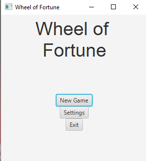
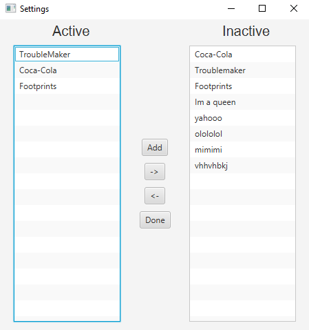
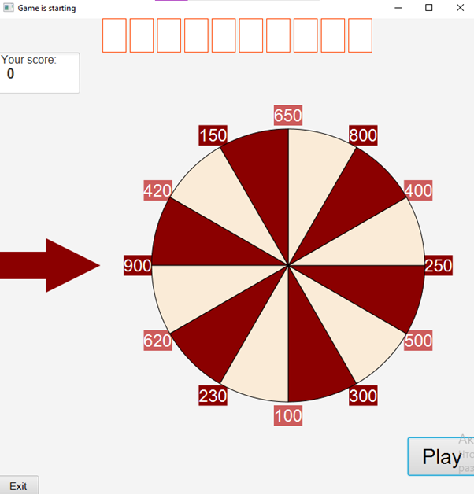
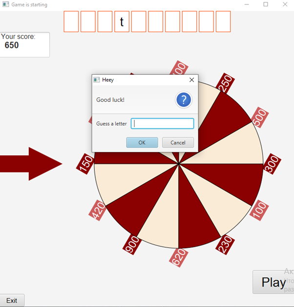

# Wheel of Fortune - word guessing game JavaFX
## Intro
This project is about word guessing game, which consists of many GUI elements built with pure JavaFX. The project was developed only for educational purposes.

## Technologies :hammer_and_pick:

Java version 8 or higher,
JavaFX

## Launch :electric_plug:

 1. Press the Fork to copy this repository to your profile

 2. Clone this project to your local environment by command:
 git clone https://github.com/nuraiza/wheel-of-fortune.git
 or simply download the project from Download section

 3. Open the project with Intellij Idea or any other Java IDE (ex Eclipse)
 4. Run the application
## How to play? :video_game:

- Player can start the game right away - New Game, or go to Settings. 

- In the settings, it is possible to add new guessing words to the list. The game chooses the guessing word from the Active list, in addition, it is possible to activate/deactivate some words by transferring them between lists. 

- If a new game is started, then it is time to press the Play.

  
 
 
 - After the wheel rotation, a pop-up window appears and asks for a letter.
- Player has 3 attempts to give the correct letter and obtain the score pointed by the arrow. If the player could not guess the right letter then he does not obtain the score, however, he can continue playing.

  

## Have fun :smile:
If you want to contribute to this project I am waiting for your pull request :)

## License :balance_scale:
Distributed under the MIT License. See LICENSE for more information.

## Contact :email:
 <a href="<https://www.linkedin.com/in/nuraiza/>"></a>

